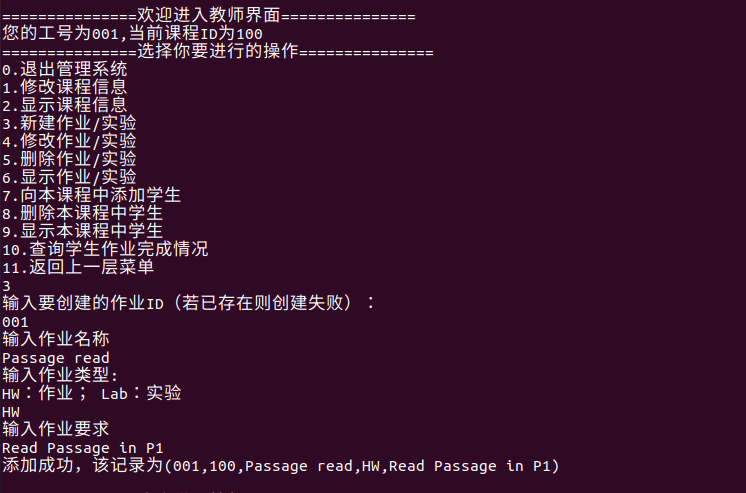

# 学生作业管理系统设计文档

## 1. 设计思想

### 1.1 存储方式

本应用程序通过文件的存储方式来实现数据的存储，多种类型的数据被存储在不同的文件中（在3.中进行详细说明）；

### 1.2 实现方式

本应用主要借助于输入输出重定向，`grep`、`sed`、`read`指令作为核心来实现不同条件下的数据的读写与更改，从而实现信息管理系统的功能

### 1.3 程序结构

采用结构化编程思想，根据三种权限的用户将程序分为三个部分，每个部分下通过各自定义的函数来实现各种操作，通过`while true`的方式来循环运行程序。（详细说明在2.中进行）

## 2. 功能模块

所有的脚本代码都集中于一个文件，但是按照各自不同的功能可以分为以下4个界面（在代码实现时也是按照以下顺序来依次实现的）

### 2.1 主菜单界面

主菜单的脚本代码位于程序文件最下方，代表着进入程序后的第一个界面，用于转入三种不同的用户界面。通过`while true`加`case`语句的方式实现反复的读取与响应，其他三个界面的主菜单代码也采用和2.1一样的形式，以下为主菜单的部分代码：

```shell
while true; do
    echo "===============选择你的登录方式==============="
    echo "0.退出学生管理系统"
    echo "1.以管理员身份登录"
    echo "2.以教师身份登录"
    echo "3.以学生身份登录"
    echo "输入command:"
    read iCommand
    case $iCommand in
    0)
        echo "已经安全退出系统."
        exit 0
        ;;
    1)
        administratorID="20200202"
        echo "请输入管理员ID号"
        read ID_1
        if [[ "$ID_1" = "$administratorID" ]]; then
            echo "ID号正确，正在进入管理员界面！"
            administratorUI
        else
            echo "ID号错误！"
        fi
        ;;
    2)
        TeacherUI
        ;;
    3)
        StuUI
        ;;
    *)
        echo "超出可选择的指令！"
        ;;
    esac
done
```

其中管理员的登录方式较为简单因此直接在该部分完成，教师与学生都是在各自界面的函数中实现登录；
输入选项后通过`administratorUI`,`TeacherUI`,`StuUI`来进入其他三种菜单界面

### 2.2 管理员界面

主菜单代码与2.1的结构一致，同样利用`while true`和`case`实现重复读取指令和响应，`case`语句中的每个选项即代表不同的操作，通过不同的函数实现，这些函数被集中放在同一段位置，以下是`case`语句的代码：
```shell
read iCommand
case $iCommand in
0)
    echo "已经安全退出系统."
    exit 0
    ;;
1)
    InsertTeacherInfo
    ;;
2)
    DeleteTeacherInfo
    ;;
3)
    ChangeTeacherInfo
    ;;
4)
    ListTeacherInfo
    ;;
5)
    InsertCourseInfo
    ;;
6)
    ChangeCourseInfo
    ;;
7)
    DeleteCourseInfo
    ;;
8)
    ListCourseInfo
    ;;
9)
    InsertStuInfo
    ;;
10)
    DeleteStuInfo
    ;;
11)
    ChangeStuInfo
    ;;
12)
    ListStuInfo
    ;;
13)
    connect_teacher_course
    ;;
14)
    disconnect_teacher_course
    ;;
15)
    List_teacher_course
    ;;
16)
    return
    ;;
*)
    echo "超出可选择的指令！"
    ;;
esac
```

通过上述代码，可以看出通过15种函数来实现各自的功能，功能与函数名一致，关于这些操作的效果可以在4.中详细看到，或在设计文档中看到属于管理员的各种操作的说明，这里不再赘述。

### 2.3 教师界面

教师界面除了具有和2.2，2.1一样的部分之外，还需要一部分脚本代码来处理用户名+密码的登录，以及根据教师绑定的课程来显示可以操作的课程。

由于源代码以及注释可以较好地说明这个过程，密码处理以及教师对于课程的选择通过源代码来展示：

以下是教师密码的检验

```shell
read teacherID
#获取教师账户所在的行
stringLine=$(grep $teacherID $DBTeacherInfoPath)
if [ "$stringLine" != "" ]; then
    {
        #获取正确的密码
        PassWord=$(echo "$stringLine" | awk -F',' '{print $4}')
        echo "请输入教工工号对应的密码"
        read iPassWord
        #比较
        if [ "$iPassWord" = "$PassWord" ]; then
            {
                echo "密码正确，正在进人教师界面"
            }
        else
            {
                echo "密码错误！"
                return
            }
        fi

    }
else
    {
        echo "不存在该教工工号"
        return
    }
fi
```

以下是根据教师ID，来显示教师绑定的所有课程ID的脚本代码

```shell
echo "您当前绑定的课程ID如下："
export existFlag=false
#在DBTeacher_CoursePath中查询与教师ID绑定的课程ID，并显示
while read line; do
    lineTeacherID=${line/,*/}
    if [ "$lineTeacherID" = "$teacherID" ]; then
        {
            existFlag=true
            #awk确定课程ID
            CourseID=$(echo "$line" | awk -F',' '{print $2}')
            echo "$CourseID"
            break
        }
    fi
done <$DBTeacher_CoursePath

#如果没有发现教师绑定任何课程则退出当前界面
if [ "$existFlag" = "false" ]; then
    {
        echo "您当前未绑定到任何课程，请联系管理员！"
        return
    }
fi
```

显示教师绑定的所有课程ID后，教师可以根据提示来输入他要操作的课程，代码如下：
```shell
declare opCourseID
    #反复输入课程ID直到输入正确为止，由于进入到这一步必定存在绑定的课程
    while true; do
        echo "请选择您要操作的课程（输入课程ID）"
        read opCourseID
        #用教师ID和课程ID来唯一确定绑定关系
        Tuple="$teacherID,$opCourseID"
        existFlag=false
        while read line; do
            if [ "$line" = "$Tuple" ]; then
                {
                    existFlag=true
                    break
                }
            fi
        done <$DBTeacher_CoursePath

        if [ "$existFlag" = "false" ]; then
            {
                echo "该课程不存在或您未绑定到该课程！"
            }
        else
            {
                echo "已查询到您账户下的该课程，正在进入课程管理界面"
                break
            }
        fi
    done
```

通过以上步骤后，就进入教师界面的主菜单，其结构与先前一致，这里通过展示`case`语句的代码来说明教师界面支持的所有操作

```shell
read iCommand
case $iCommand in
0)
    echo "已经安全退出系统."
    exit 0
    ;;
1)
    ChangeCourseInfo_Tea "$opCourseID"
    ;;
2)
    ListCourseInfo_Tea "$opCourseID"
    ;;
3)
    CreateHomeWork "$opCourseID"
    ;;

4)
    ChangeHomeWork

    ;;

5)
    DeletHomeWork
    ;;

6)
    ShowAllHomeWork
    ;;

7)
    AddStuToCourse "$opCourseID"
    ;;
8)
    DelStuFromCourse "$opCourseID"
    ;;

9)
    ListStuFromCourse "$opCourseID"
    ;;
10)

    CheckHomeFinish
    ;;
11)
    return
    ;;
*)
    echo "超出可选择的指令！"
    ;;

esac

```

### 2.4 学生界面

学生界面与教师界面类似，只不过没有选择课程的过程，通过密码检验后就进入学生界面的菜单，密码检验与先前完全一致，这里不再作展示，以下同样通过`case`语句来展示学生界面支持的操作。

```shell
read iCommand
case $iCommand in
0)
    echo "已经安全退出系统."
    exit 0
    ;;
1)
    ShowHW_Stu "$StuID"
    ;;
2)
    ChangeHW_Stu "$StuID"
    ;;
3)
    return
    ;;
*)
    echo "超出可选择的指令！"
    ;;

esac
```

## 3. 数据结构（存储方式）

在脚本程序内部没有使用高级的数据结构，因此在这里对存放数据的文件进行说明：

根据文件种类不同，数据分为以下7个文件来进行存储，数据的格式以及含义在注释中进行了说明

```shell
#教师数据
#数据格式（教师ID，教师姓名，所属院系，账户密码）
DBTeacherInfoPath="./DBFile/DBTeacherInfo.txt"
#课程数据
#数据格式（课程ID，课程名称，课程信息）
DBCourserInfoPath="./DBFile/DBCourseInfo.txt"
#学生数据
#数据格式（学生ID，学生姓名，所属院系，账户密码）
DBStuInfoPath="./DBFile/DBStuInfo.txt"
#课程与教师绑定关系的数据
#数据格式（教师ID，课程ID）
DBTeacher_CoursePath="./DBFile/DBTea_Course.txt"
#课程内学生的数据
#数据格式（课程ID，学生ID，学生姓名）
DBClassPath="./DBFile/DBClass.txt"
#作业数据
#数据格式（作业ID，课程ID，作业名称，作业类型，作业信息）
DBHomeWorkPath="./DBFile/DBHomeWork.txt"
#学生作业完成情况数据
#数据格式（作业ID，学生ID，学生姓名，作业完成情况）
DBStuHomeWorkPushPath="./DBFile/StuHomeWorkPush.txt"
```

其中需要稍作说明的是，除了**学生作业完成情况数据**这一数据之外，其他数据都可以通过主动操作来创建和删除，而**学生作业完成情况数据**是跟随作业数据一起产生的，其产生过程是自动的，而随着对应作业的删除，**学生作业完成情况数据**也会进行相应的删除。

## 4. 功能测试

以下通过截图与说明的方式来展示本程序功能;
在测试程序前提前准备了一些数据以供测试；


### 4.1 主菜单界面(以及进入其他界面的过程)

1. 输入脚本程序，启动主菜单


2. 通过管理员ID 20200202登录管理员界面


3. 进入教师登录界面


4. 进入学生登录界面


### 4.2 管理员界面


以下操作均为在以及基础数据的基础上，按照顺序完成，可以通过后方的操作截图看到前方操作的效果（例如通过显示教师信息看到修改教师信息的作用）

由于管理员可以进行的操作诸多，且可能出现的错误反馈也很多，因此无法一一展示，这里通过对教师信息的操作以及教师和课程的绑定操作来作为范例，其他操作可以自行运行程序尝试。

1. 创建教师信息


2. 修改教师信息


3. 显示教师信息


4. 删除教师信息


    删除后通过显示来展示效果


5. 绑定教师与课程


6. 显示教师与课程的绑定


7. 接触教师与课程的绑定


8. 部分错误反馈：

    修改不存在的教师信息


    绑定不存在的教师


### 4.3 教师界面

这里同样展示部分功能作为范例，其他指令可以运行程序自行尝试：

1. 显示课程信息


2. 修改课程信息


3. 向课程中添加学生


4. 删除课程中的学生


5. 显示课程中的学生


6. 创建新的作业



7. 检查作业完成情况


### 4.4 学生界面

学生界面操作相对较少，这里作全部展示

1. 修改作业状态


2. 显示自己的作业


3. 部分错误反馈


